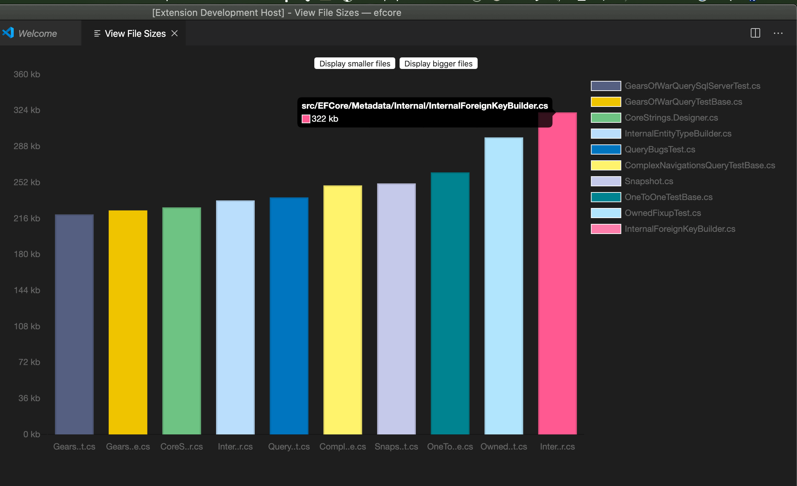
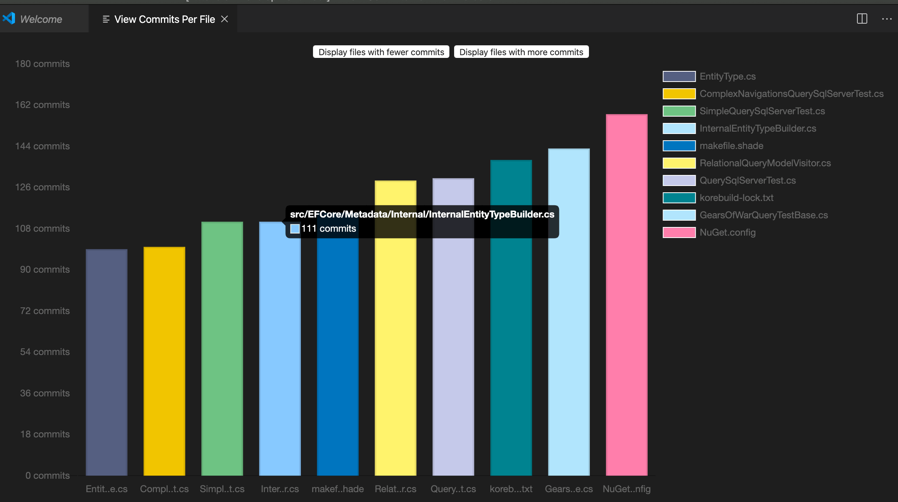
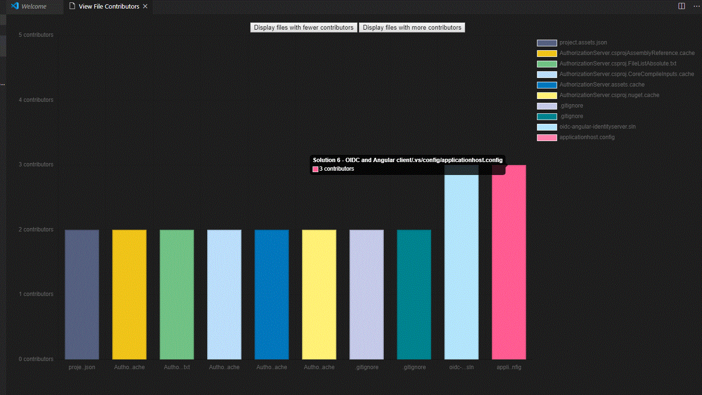

# GitGraphy

[](https://dev.azure.com/pierobond/GitGraphy/_build/latest?definitionId=2&branchName=master)

## Description

Visualize statistics of your git repository directly within Visual Studio Code.

## Main Features
- View commits by author as a pie chart (based on [chartjs](https://www.chartjs.org/))
- View number of commits per file as a bar (based on [chartjs](https://www.chartjs.org/))
- Display the biggest files in the repo (based on [chartjs](https://www.chartjs.org/))

## Useful commands
Open the Command Palette (Command+Shift+P on macOS and Ctrl+Shift+P on Windows/Linux) and type in one of the following commands:

Command | Description
--- | ---
```Git Graphy: View Commits``` | View Commit Chart by author.
```Git Graphy: View Commits Per File``` | View Commit Chart per file.
```Git Graphy: View Largest files``` | Show the largest files in the repository.
```GitGraphy: View the files with the most contributors``` | Show the files with the most contributors in the repository.

## Output samples

### Git Graphy: View Largest files on the EF core repo



### Git Graphy: View Commits Per File on the EF core repo



### Git Graphy: View the files with the most contributors on the oidc angular repo



## License

Started as a copy of simple-git-stats https://github.com/HoangNguyen17193/vscode-simple-git-stats

[MIT License](LICENSE)
